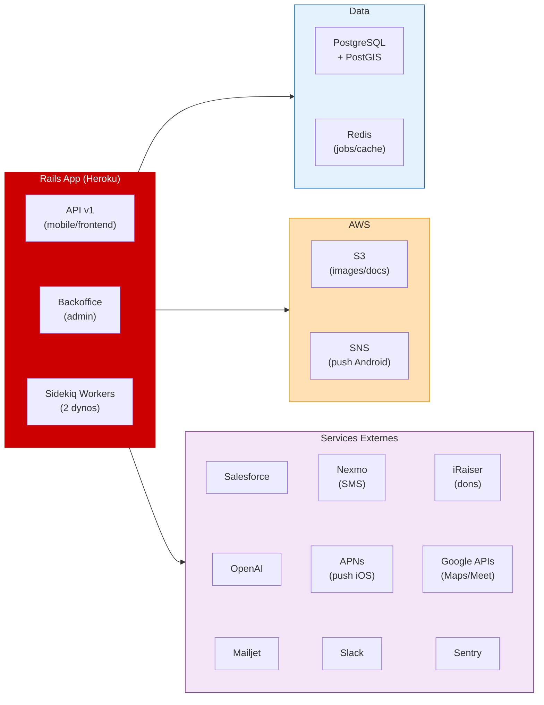

Generate or update `TECH_ARCH.md` at the root of the `entourage-back-preprod` repo with up-to-date Mermaid architecture diagrams.

## Goal

Produce a `TECH_ARCH.md` that contains:
1. A **simplified overview diagram** (high-level, no labels on arrows, nodes grouped by provider)
2. A **detailed diagram** (all app layers, Sidekiq queues, data flows with labels)
3. A **Sidekiq jobs table** (all job classes with queue and purpose)
4. An **external services table** (role, auth, used by)
5. An **infrastructure section** (runtime, framework, deployment, secrets, queues)

---

## Steps

### 1. Discover app structure

Read the following to understand all components:

```bash
ls app/controllers/
ls app/controllers/api/v1/
ls app/controllers/admin/
ls app/jobs/
ls app/services/
cat Procfile.api-prod
cat Procfile.backoffice-prod
```

### 2. Extract Sidekiq queues and jobs

From `Procfile.api-prod` (or `Procfile.backoffice-prod`), extract the Sidekiq worker definitions:
- Each `sidekiq` line lists `-q <queue>` flags — extract all queue names
- List all files in `app/jobs/` and read each one to extract:
  - The job class name
  - The `sidekiq_options queue:` or `queue_as` declaration
  - A one-line description of what the job does (from class name + body)

### 3. Identify all external services

From `Gemfile` and environment variable names in `config/`, `app/services/`, `app/controllers/`, identify:

- **AWS services**: S3 (`aws-sdk-s3`), SNS (`aws-sdk-sns`)
- **Database**: PostgreSQL + PostGIS (`pg`, `activerecord-postgis-adapter`), Redis (`redis`)
- **CRM**: Salesforce (`restforce`)
- **AI**: OpenAI (`ruby-openai`)
- **Email**: Mailjet (`mailjet`), ActionMailer
- **SMS**: Nexmo/Vonage (`nexmo`)
- **Push notifications**: Rpush + Apnotic (iOS/APNs), AWS SNS (Android)
- **Maps/Calendar**: Google APIs (`google-api-client`) — Maps Static, Google Meet
- **Alerting**: Slack (`slack-notifier`)
- **Donations**: iRaiser (webhook receiver via `app/controllers/iraiser_controller.rb`)
- **Monitoring**: Sentry (`sentry-ruby`)
- **Scheduling**: Sidekiq Web UI (`sidekiq/web`)

### 4. Identify API surface

From `config/routes.rb`, extract the main route namespaces:
- Mobile/frontend JSON API: `api/v1/` routes
- Admin backoffice: `admin` subdomain routes (with sub-namespaces like `salesforce`)
- Webhook receivers: top-level controllers (`iraiser`, `mailjet`, `slack`)
- Public routes: `public_user` namespace

### 5. Write the simplified diagram



Rules for the simplified diagram:
- **No labels on arrows** — plain `-->` only
- Rails app grouped in one `App` subgraph, components on one line via `~~~`
- AWS resources grouped in `AWS` subgraph
- Databases grouped in `DB` subgraph (PostgreSQL + Redis)
- All other external services grouped in `External` subgraph
- Colors: Rails box red (`#CC0000`), AWS box light orange, DB box light blue, External box light purple

### 6. Write the detailed diagram

```mermaid
graph TB
    subgraph Clients["Clients"]
        Mobile["Mobile App\n(iOS/Android)"]
        Frontend["Frontend\n(entourage-job-front)"]
        AdminUser["Admin\n(backoffice)"]
        Webhooks["Webhooks entrants\n(iRaiser / Mailjet / Slack)"]
    end

    subgraph Rails["Rails App — Ruby 3.2 / Rails 7.1"]
        subgraph APILayer["API v1"]
            ... main API controllers with key routes ...
        end
        subgraph AdminLayer["Backoffice Admin"]
            ... admin controllers by namespace ...
        end
        subgraph WebhookLayer["Webhook Controllers"]
            ... webhook receiver controllers ...
        end
        subgraph JobsLayer["Sidekiq Jobs"]
            subgraph QueueSMS["Queue: sms"]
                ... SMS-related jobs ...
            end
            subgraph QueueSF["Queue: salesforce"]
                ... Salesforce jobs ...
            end
            subgraph QueueDefault["Queue: default / mailers / openai / broadcast / denorm / translation"]
                ... all other jobs ...
            end
        end
    end

    subgraph DataLayer["Données"]
        PG["PostgreSQL + PostGIS"]
        Redis["Redis"]
    end

    subgraph AWSLayer["AWS"]
        S3["S3 (images)"]
        SNS["SNS (push Android)"]
    end

    subgraph ExtLayer["Services Externes"]
        SF["Salesforce"]
        OpenAI["OpenAI"]
        Mailjet["Mailjet"]
        Nexmo["Nexmo SMS"]
        APNs["APNs (iOS push)"]
        Slack["Slack"]
        Google["Google Maps / Meet"]
        Sentry["Sentry"]
    end

    ... all arrows with labels ...
```

Rules for the detailed diagram:
- Group API controllers by functional area (Users, Groups/Entourages, Neighborhoods, Chat, etc.)
- Group Sidekiq jobs by queue name in sub-subgraphs
- Use `-->|"label"|` syntax for labeled arrows
- Use `-.->` for monitoring/error reporting (Sentry)
- Show the subdomain constraint for Admin routes in a note
- Distinguish webhook *receivers* (inbound) from service *callers* (outbound)

### 7. Write the Sidekiq jobs table

Columns: **Classe** | **Queue** | **Rôle**

Read each file in `app/jobs/` and fill one row per job class. If a job has no explicit queue declaration, default to `default`. Describe the job's purpose from its class name and body (1 sentence).

### 8. Write the external services table

Columns: **Service** | **Rôle** | **Authentification** | **Utilisé par**

Cover: PostgreSQL, Redis, AWS S3, AWS SNS, Salesforce, OpenAI, Mailjet, Nexmo, APNs (rpush/apnotic), Slack, Google APIs, iRaiser, Sentry.

### 9. Write the infrastructure section

Include:
- **Ruby version**: from `Gemfile` (`ruby '...'`)
- **Rails version**: from `Gemfile` (`gem 'rails', '...'`)
- **Deployment**: Heroku dynos (web + worker_1 + worker_2), release command
- **Web server**: Puma (`config/puma.rb`)
- **Background jobs**: Sidekiq with 2 worker dynos, list all queues and their concurrency
- **Database**: PostgreSQL + PostGIS extension, Redis
- **Scheduler**: `whenever` gem (currently unused / all schedules commented out)
- **Secrets**: Rails `config/secrets.yml` + environment variables
- **Environments**: development, preprod, production (separate Procfiles per env)
- **CI**: CircleCI (`circle.yml`)
- **Container**: Docker available (`docker-compose.yml`) for local dev

### 10. Update TECH_ARCH.md

Rewrite the file with all sections in order:
1. Title + intro sentence
2. `## Aperçu simplifié` + simplified diagram
3. `## Vue d'ensemble détaillée` + detailed diagram
4. `## Jobs Sidekiq` + table
5. `## Services externes` + table
6. `## Infrastructure` + bullet list

If no `TECH_ARCH.md` exists yet, create it. Write in **French**. Preserve the existing structure if updating.
