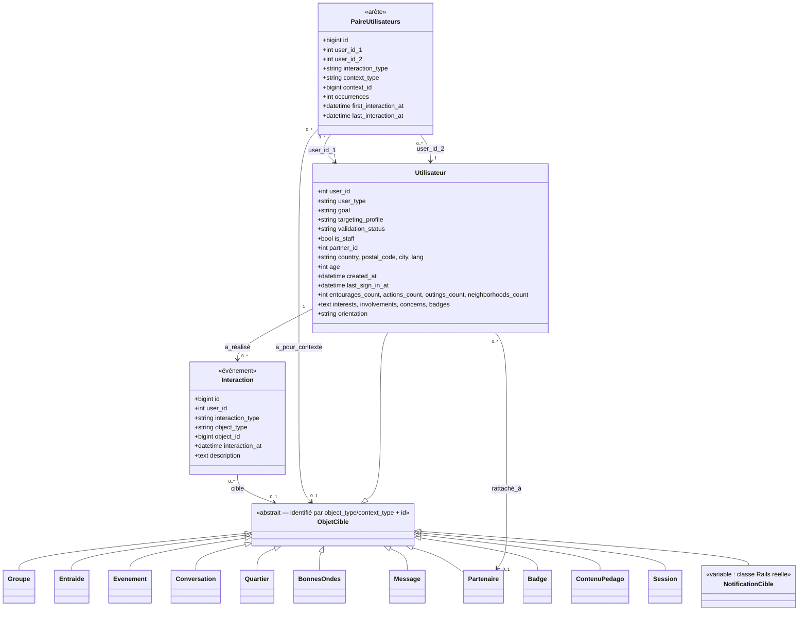

# Ontologie des tables `stats.user_profile`, `stats.user_interactions` et `stats.user_interaction_pairs`

Ce document formalise le **vocabulaire conceptuel** (classes, propriétés,
relations, taxonomies contrôlées) sous-jacent aux trois tables décrites
dans `stats_tables_guide.md`. Il s'adresse à qui veut construire un graphe,
un modèle de clustering ou un mapping vers un outil d'ontologie
(Protégé, RDF, Neo4j...) à partir de ces données, indépendamment du schéma
SQL brut.

Convention : `stats.user_profile` matérialise les **nœuds**,
`stats.user_interactions` le **journal d'événements**, et
`stats.user_interaction_pairs` les **arêtes** directes entre nœuds. Cette
ontologie donne le modèle conceptuel commun aux trois.

## 1. Vue d'ensemble

## 2. Classes

| Classe                | Table / origine                              | Définition |
|------------------------|-----------------------------------------------|------------|
| `Utilisateur`            | `stats.user_profile`, 1 ligne = 1 instance     | Un compte de la plateforme Entourage (bénéficiaire, aidant, pro, partenaire, staff...) |
| `Interaction`              | `stats.user_interactions`, 1 ligne = 1 instance  | Un événement horodaté produit par un `Utilisateur`, éventuellement dirigé vers un `ObjetCible` |
| `PaireUtilisateurs`          | `stats.user_interaction_pairs`, 1 ligne = 1 instance | Une relation binaire, non orientée, entre deux `Utilisateur` ayant réellement interagi dans un contexte donné, agrégeant plusieurs `Interaction` |
| `ObjetCible`                   | classe abstraite, dérivée de `object_type`/`context_type` | Ce vers quoi une `Interaction` ou un contexte de `PaireUtilisateurs` pointe. N'a pas de table dédiée dans `stats` — c'est une référence vers une table applicative (`entourages`, `chat_messages`, `neighborhoods`, `users`...) |

### Sous-classes de `ObjetCible`

Une sous-classe par valeur de `object_type` (interactions) ou
`context_type` (paires) — ce sont les mêmes classes conceptuelles, réparties
différemment selon la table :

| Sous-classe        | Table applicative source            | Utilisée par |
|----------------------|----------------------------------------|----------------|
| `Session`               | `login_histories` / `session_histories` | `Interaction` uniquement |
| `Groupe`                  | `entourages` (`group_type='group'`)       | `Interaction` uniquement |
| `Entraide`                  | `entourages` (`group_type='action'`)        | `Interaction` uniquement |
| `Evenement`                   | `entourages` (`group_type='outing'`)          | `Interaction` et `PaireUtilisateurs` |
| `Conversation`                  | `entourages` (`group_type='conversation'`)      | `Interaction` et `PaireUtilisateurs` |
| `Quartier`                         | `neighborhoods`                                   | `Interaction` et `PaireUtilisateurs` |
| `BonnesOndes`                        | `user_smalltalks`                                   | `Interaction` et `PaireUtilisateurs` |
| `Message`                              | `chat_messages`                                       | `Interaction` uniquement (cible d'une `reaction` ou d'une `reponse_sondage`) |
| `Utilisateur` (en tant que cible)         | `users`                                                 | `Interaction` uniquement (`blocage_utilisateur`, `invitation_envoyee`) — même classe que le sujet, réutilisée comme objet |
| `Partenaire`                                 | `partners`                                                | `Interaction` uniquement |
| `Badge`                                        | `user_badges` / `badges`                                    | `Interaction` uniquement |
| `ContenuPedago`                                  | `users_resources`                                             | `Interaction` uniquement |
| `NotificationCible`                                | variable (`inapp_notifications.instance`/`instance_baseclass`) | `Interaction` uniquement — cas particulier, cf. §5 |

`Groupe` et `Entraide` n'apparaissent jamais comme `context_type` de
`PaireUtilisateurs` : les interactions dans ces contenants sont exclues par
construction (cf. `stats_tables_guide.md`).

## 3. Propriétés de données (datatype properties)

### `Utilisateur`
Reprend une à une les colonnes de `stats.user_profile` (identité,
segmentation, statut, localisation, ancienneté, compteurs d'activité,
préférences taxonomiques `interests`/`involvements`/`concerns`/`badges` en
listes de tags). Voir le détail colonne par colonne dans
`stats_tables_guide.md` §`stats.user_profile`.

### `Interaction`
- `interaction_at` (datetime) — date métier de l'événement
- `description` (text) — attributs additionnels non structurés, format
  `clé=valeur` variable selon `interaction_type`

### `PaireUtilisateurs`
- `occurrences` (int) — poids de l'arête
- `first_interaction_at`, `last_interaction_at` (datetime) — bornes
  temporelles de la relation agrégée

`ObjetCible` et ses sous-classes n'ont pas d'attributs propres dans ce
modèle : seule leur identité (`object_type`/`context_type` + id) est
connue depuis `stats.*` ; leurs attributs vivent dans les tables
applicatives d'origine et sont hors périmètre de cette ontologie.

## 4. Propriétés d'objet (relations)

| Relation                | Domaine              | Portée        | Cardinalité         | Source SQL |
|---------------------------|-------------------------|-----------------|-----------------------|--------------|
| `a_réalisé` / `réalisée_par` (inverse) | `Utilisateur` | `Interaction`     | 1 → 0..*                | `user_interactions.user_id` |
| `cible`                      | `Interaction`             | `ObjetCible`        | 0..1 → 0..*                | `user_interactions.object_type` + `object_id` (nul pour `connexion`, `session`) |
| `implique_1`                    | `PaireUtilisateurs`         | `Utilisateur`         | 1 → 0..*                     | `user_interaction_pairs.user_id_1` (toujours le plus petit id) |
| `implique_2`                      | `PaireUtilisateurs`           | `Utilisateur`           | 1 → 0..*                       | `user_interaction_pairs.user_id_2` (toujours le plus grand id) |
| `a_pour_contexte`                    | `PaireUtilisateurs`             | `ObjetCible` (restreint à `Quartier`, `Evenement`, `Conversation`, `BonnesOndes`) | 0..1 → 0..* | `user_interaction_pairs.context_type` + `context_id` |
| `rattaché_à`                           | `Utilisateur`                     | `Partenaire`               | 0..1 → 0..*                       | `user_profile.partner_id` |

Relations dérivées, non matérialisées mais reconstructibles (cf.
`stats_tables_guide.md` §« Construire un graphe ») :
- **`a_bloqué` / `a_invité`** : sous-propriétés de `cible`, restreintes à
  `ObjetCible = Utilisateur` (`interaction_type` = `blocage_utilisateur` /
  `invitation_envoyee`) — relations orientées `Utilisateur → Utilisateur`.
- **`co_actif_dans`** : relation symétrique dérivée en croisant deux
  `Interaction` de `user_id` différents partageant le même `(object_type,
  object_id)` — utile notamment pour `Groupe`/`Entraide`, hors périmètre de
  `PaireUtilisateurs`.

`PaireUtilisateurs` est elle-même la réification d'une relation
`Utilisateur ↔ Utilisateur` typée (`interaction_type`) et contextualisée
(`a_pour_contexte`) — l'équivalent, en modèle RDF, d'un nœud d'arête portant
des propriétés (poids, dates) plutôt qu'une simple propriété d'objet directe.

## 5. Taxonomies contrôlées

### 5.1 `interaction_type` de `Interaction`, regroupé par catégorie

| Catégorie                | Valeurs |
|----------------------------|-----------|
| Connexion                     | `connexion`, `session` |
| Création de contenant            | `creation_groupe`, `creation_entraide`, `creation_evenement`, `creation_conversation`, `creation_quartier` |
| Adhésion / participation           | `demande_adhesion`, `demande_adhesion_entraide`, `adhesion_confirmee`, `adhesion_confirmee_entraide`, `participation_evenement` |
| Communication                        | `message_envoye`, `publication_groupe`, `reaction`, `reponse_sondage` |
| Action interpersonnelle directe        | `blocage_utilisateur`, `invitation_envoyee` |
| Partenariat                              | `suivi_partenaire`, `demande_partenariat` |
| Bonnes ondes                               | `inscription_bonnes_ondes`, `match_bonnes_ondes` |
| Gamification                                 | `badge_obtenu` |
| Notification                                   | `notification_recue` |
| Contenu pédagogique                              | `visionnage_contenu_pedago` |

Le détail table source / date / `object_type` par valeur est dans
`stats_tables_guide.md` §« Types d'interaction ».

### 5.2 `interaction_type` de `PaireUtilisateurs`

| Valeur                    | `context_type` possibles |
|-----------------------------|------------------------------|
| `echange_messages`             | `Quartier`, `Evenement`, `Conversation`, `BonnesOndes` |
| `reaction`                        | `Quartier`, `Evenement`, `Conversation`, `BonnesOndes` |
| `participation_evenement`           | `Evenement` |

### 5.3 Axes de segmentation de `Utilisateur`

- `goal` : `offer_help`, `ask_for_help`, `organization`, `staff`, `NULL`
- `targeting_profile` : `asks_for_help`, `offers_help`, `partner`, `team`,
  `ambassador`, `NULL`
- `validation_status` : `validated`, `blocked`, `temporary_blocked`,
  `deleted`, `pending`
- `user_type` : `pro`, `public`

## 6. Axiomes et contraintes

- **Non-directionnalité normalisée de `PaireUtilisateurs`** :
  `user_id_1 < user_id_2` toujours (`LEAST`/`GREATEST`) — une paire n'existe
  jamais dans les deux sens.
- **Unicité** : au plus une instance de `PaireUtilisateurs` par
  `(user_id_1, user_id_2, interaction_type, context_type, context_id)` — la
  même paire peut donc avoir plusieurs arêtes si elle interagit dans
  plusieurs contextes ou selon plusieurs types.
- **Périmètre utilisateurs asymétrique** : `PaireUtilisateurs` exclut tout
  `Utilisateur` avec `targeting_profile = 'team'` (tous les comptes
  Entourage), alors que `Utilisateur`/`Interaction` n'excluent que les
  modérateurs (`is_staff`). Une jointure `Utilisateur ↔ PaireUtilisateurs`
  doit donc filtrer `is_staff` côté `Interaction`/`Utilisateur` en plus.
- **Exclusion des blocages** : deux `Utilisateur` liés par une relation
  `a_bloqué` (dans un sens ou l'autre, à la date d'exécution du script) ne
  peuvent pas avoir de `PaireUtilisateurs` — un blocage récent efface une
  interaction passée de l'arête, sans effacer les `Interaction`
  individuelles sous-jacentes.
- **Pas de clé étrangère physique** : toutes les relations ci-dessus sont
  des conventions applicatives (`user_id`, `object_id`/`context_id`), non
  contraintes en base — l'intégrité référentielle est à valider côté
  requête si nécessaire.
- **Non-immuabilité** : `Interaction` et `PaireUtilisateurs` sont
  recalculées à partir de l'état courant des tables applicatives ; une
  `Interaction` peut disparaître d'un run à l'autre si sa source a été
  supprimée/modifiée (`interaction_at` reste la date d'origine mais
  n'implique pas que la ligne ait toujours existé dans `stats.*`).
- **`NotificationCible` est polymorphe** : contrairement aux autres
  sous-classes de `ObjetCible`, sa classe réelle n'est connue qu'à
  l'exécution (portée par la donnée elle-même) plutôt que fixée par la
  taxonomie — à traiter à part pour toute inférence de type.

## 7. Table de correspondance ontologie ↔ SQL

| Concept ontologique          | Colonne(s) SQL |
|---------------------------------|-------------------|
| Identité de `Utilisateur`          | `user_profile.user_id` = `user_interactions.user_id` = `user_interaction_pairs.user_id_1`/`user_id_2` |
| Type de `Interaction`                 | `user_interactions.interaction_type` |
| Identité de `ObjetCible` (côté `Interaction`) | `user_interactions.object_type` + `object_id` |
| Type de `PaireUtilisateurs`              | `user_interaction_pairs.interaction_type` |
| Identité de `ObjetCible` (côté `PaireUtilisateurs`) | `user_interaction_pairs.context_type` + `context_id` |
| Poids de `PaireUtilisateurs`                | `user_interaction_pairs.occurrences` |

Pour l'export et le chargement dans un outil de graphe, voir
`export_stats_tables.sql` référencé dans `stats_tables_guide.md`.
